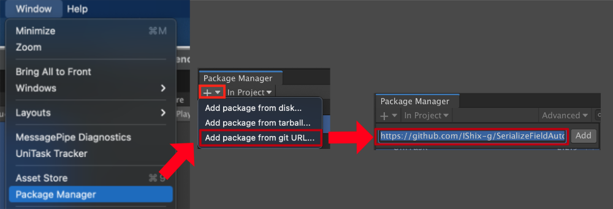

# Unity Version
Unity 2019.4 higher

# Easily manage your ID.

You can change the order of IDs and rename them. The change will not break the reference.


## Easy setting and selection

You can pull down the items you have set by simply adding attributes.  
The value is just a simple string, easy to handle.

```c#
[SerializeField, CharacterIDReference] string characterID; //Inspector:Cat 猫 characterID:IDRef-Character-iwp05
```


## Changeable

The dedicated panel makes it easy to modify.

- Changing the name does not affect the reference in the destination.
- Changing the order will not affect the reference at the destination.
- Using a language other than English is not a problem.


## See where to use ID.

The dedicated panel makes it easy to modify.

- Show all references
- Go to references
- Print to references


# Getting started

## Package Manager

URL : `https://github.com/IShix-g/IDReference.git?path=Assets/Plugins/IDReference`

### [Unity 2019.3 higher] Install via git URL
Add the Url to Package Manager



## Unitypackage

[IDReference/releases](https://github.com/IShix-g/IDReference/releases/)


# Quick Start

### [Step1] Initialization.

```c#
using IDRef;

#if UNITY_EDITOR
using UnityEditor;

// [Step1] Initialization (editor only)
[InitializeOnLoad]
public sealed class IDReferenceSetting
{
    static readonly IDReferenceTable characterTable;

    static IDReferenceSetting()
    {
        characterTable = new IDReferenceTable("Character", false, false);
        IDReferenceProvider.SetTable(characterTable);
    }
}
#endif
```

### [Step2] Defining Attributes.

```c#
// [Step2] Defining Attributes
public sealed class CharacterIDReferenceAttribute : IDReferenceAttribute
{
    public override string GetTableID() => "Character";
}
```

### [Step3] Adding attributes to scripts.

```c#
// [Step3] Adding attributes to scripts.
using UnityEngine;

public sealed class IDReferenceTest : MonoBehaviour
{
    [SerializeField, CharacterIDReference] string characterID;
```

### [Step4] Adding an ID


### Notes.

> - Multiple registrations are also possible.
> - All of this is only available in the Unity Editor.
> - The initialization code must be enclosed in `UNITY_EDITOR`.
> - Do NOT enclose the Attribute code in `UNITY_EDITOR`, as it will be referenced by other classes.

# Options

## Disable the Delete button

If you delete an ID, you will not be able to refer to that ID. If you disable the delete button, you can sleep in peace. :)

```c#
characterTable = new IDReferenceTable("Character", disableRemoveButton: true);
```


## Disable add ID in dropdown.

By disabling add ID in the drop-down, you can make it so that only you can edit it.

```c#
characterTable = new IDReferenceTable("Character", disableDropDownAddID: true);
```


## Custom menu

You can access the ID list by adding a custom menu.

```c#
static readonly IDReferenceTable characterTable;

static IDReferenceSetting()
{
    characterTable = new IDReferenceTable("Character", false, false);
    IDReferenceProvider.SetTable(characterTable);
}

// Add to menu
[MenuItem("IDReference/Character")]
public static void CharacterCustomMenu()
{
    characterTable.ShowSettingDialog();
}
```


# ID Reference

**Editor only.**


The `characterID` contains an auto-generated ID.  
In the editor, this can be converted to an object called `IdReference`.  
The `IdReference` contains the ID and the Name.

```c#

using UnityEngine;

public sealed class IDReferenceTest : MonoBehaviour
{
    [SerializeField, CharacterIDReference] string characterID;

    void Start()
    {
#if UNITY_EDITOR
        // convert to IdReference
        var idReference = characterID.ToIDReferenceEditorOnly();
        
        if (idReference.IsValid())
        {
            var name = idReference.Name;
            var id = idReference.ID;
    
            Debug.Log($"Name:{name} ID:{id}");
            // Name:Cat 猫 ID:IDRef-Character-iwp05
        }
#endif
    }
}
```

# Comparison of ID management

It is assumed that the settings are made from the Unity inspector.

|    |  IDReference  |  int  |  string  |  enum  |
| ---- | ---- | ---- | ---- | ---- |
|  Rename   |  OK  |  NG  |  NG  | OK |
|  Reorder  |  OK  |  NG  |  NG  | NG |
|  Use  |  OK  |  NG(typo)  |  NG(typo)  | OK |
|  Understandability  |  OK  |  NG  |  OK  | OK |
|  Reference check  |  OK  |  NG  |  NG  | NG |

# Sample ID list
