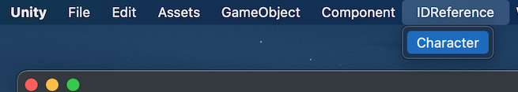

# Unity Version
Unity 2021.3 higher

# Easily manage your ID.

Users want to be able to easily select and change the `Name`.  
The system needs a unique `ID` that will never change.  
`IDReference` satisfies the exact opposite requirements of the user and the system.


## Easy selection

Just select from the pull-down menu and you won't make a mistake.

```c#
[SerializeField, CharacterIDReference] string characterID;
//Inspector:Cat 猫 characterID:IDRef-Character-iwp05
```


## Changeable

The dedicated panel makes it easy to modify.

- Changing the name does not affect the reference in the destination.
- Changing the order will not affect the reference in the destination.
- Using a language other than English is not a problem.


## See where to use ID.

The dedicated panel makes it easy to modify.

- Show all references
- Jump to references
- Print reference


# Getting started

## Package Manager

URL : `https://github.com/IShix-g/IDReference.git?path=Assets/Plugins/IDReference`

### [Unity 2019.3 higher] Install via git URL
Add the Url to Package Manager


## Unitypackage

[IDReference/releases](https://github.com/IShix-g/IDReference/releases/)


# Quick Start

### [Step1] Initialization.

```c#
#if UNITY_EDITOR
using UnityEditor;
using IDRef;

// [Step1] Initialization (editor only)
[InitializeOnLoad]
public sealed class IDReferenceSetting
{
    static IDReferenceTable characterTable;

    static IDReferenceSetting()
    {
        EditorApplication.delayCall += Initialize;
    }
    
    static void Initialize()
    {
        characterTable = new IDReferenceTable("Character", false, false);
        IDReferenceProvider.SetTable(characterTable);
    }
}
#endif
```

### [Step2] Defining Attributes.

```c#
using IDRef;

public sealed class CharacterIDReferenceAttribute : IDReferenceAttribute
{
    public override string GetTableID() => "Character";
}
```

### [Step3] Adding attributes to scripts.

```c#
using UnityEngine;

public sealed class IDReferenceTest : MonoBehaviour
{
    [SerializeField, CharacterIDReference] string characterID;
```

### [Step4] Adding an ID


### [Option] Custom menu

You can access the `ID reference list` by adding a custom menu.  
It is useful to have it set up.



```c#
static IDReferenceTable characterTable;

static IDReferenceSetting()
{
    EditorApplication.delayCall += Initialize;
}

static void Initialize()
{
    characterTable = new IDReferenceTable("Character", false, false);
    IDReferenceProvider.SetTable(characterTable);
}

// Add to menu
[MenuItem("IDReference/Character")]
public static void CharacterCustomMenu()
{
    characterTable.ShowSettingDialog();
}
```

### Notes.

> - Multiple registrations are also possible.
> - All of this is only available in the Unity Editor.
> - The initialization code must be enclosed in `UNITY_EDITOR`.
> - Do NOT enclose the Attribute code in `UNITY_EDITOR`, as it will be referenced by other classes.

# Options

## Disable the Delete button

If you delete an ID, you can no longer reference that ID. This is the only weakness of `IDReference`.  
If you disable the delete button, you can sleep easy knowing that the reference will never be corrupted :)

```c#
characterTable = new IDReferenceTable("Character", disableRemoveButton: true);
```


## Disable add ID in dropdown.

By disabling add ID in the drop-down, you can make it so that only you can edit it.

```c#
characterTable = new IDReferenceTable("Character", disableDropDownAddID: true);
```


## Set initial values

By setting initial values, you can set your own ID.
The added ID cannot be deleted or edited and is displayed in blue text.

```c#
characterTable = new IDReferenceTable("Character", required: new []{ new IDReference("Mob モブ", "Mob") });
```


# ID Reference Object

**Editor only.**


If IDs alone are difficult to understand, you can use `ToIDReferenceEditorOnly()` to convert the string into an `IDReference Object`.

```c#

using UnityEngine;

public sealed class IDReferenceTest : MonoBehaviour
{
    [SerializeField, CharacterIDReference] string characterID;

    void Start()
    {
#if UNITY_EDITOR
        // convert to IdReference
        var idReference = characterID.ToIDReferenceEditorOnly();
        
        if (idReference.IsValid())
        {
            var name = idReference.Name;
            var id = idReference.ID;
    
            Debug.Log($"Name:{name} ID:{id}");
            // Name:Cat 猫 ID:IDRef-Character-iwp05
        }
#endif
    }
}
```

# CSV Import / Export

`Shift_JIS` support.


# Comparison of ID management

It is assumed that the settings are made from the Unity inspector.

|    |  IDReference  |  int  |  string  |  enum  |
| ---- | ---- | ---- | ---- | ---- |
|  Rename   |  Excellent  |  Poor  |  Poor  | Excellent |
|  Reorder  |  Excellent  |  Fair  |  Fair  | Fair |
|  Use  |  Excellent  |  Poor  |  Poor  | Excellent |
|  Understandability  |  Excellent  |  Poor  |  Excellent  | Excellent |
|  Reference check  |  Excellent  |  N/A  |  N/A  | N/A |

# Sample ID list

Character / Item / Monster / Story


# Library

- [stevehansen/csv](https://github.com/stevehansen/csv)  
  I use it for importing and exporting CSV.
