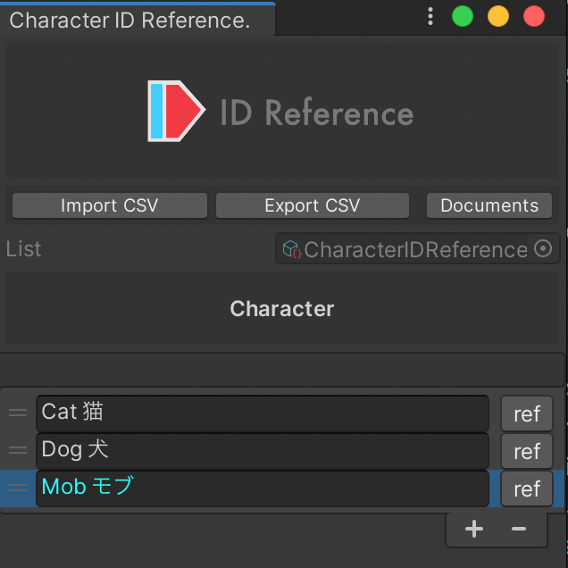

# ID Reference


## IDの管理を簡単に

プログラマーは、簡単に`Name`（名前）を変更したいと考えていますが、システムは変更されない一意の`ID`が必要です。
`IDReference`は、プログラマーとシステムの正反対の要件を満たします。


### プルダウンで簡単に選択

プルダウンメニューから選ぶだけで、間違えません。

```c#
[SerializeField, CharacterIDReference] string characterID;
//Inspector:Cat 猫 characterID:IDRef-Character-iwp05
```


### 変更が容易

設定画面で簡単に修正できます。

- 名前を変更しても参照先には影響ありません。
- 順序を変更しても参照先には影響ありません。
- 英語以外の言語を使用しても問題ありません。


### IDの使用箇所を確認

設定画面で確認できます。

- すべての参照を表示
- 参照にジャンプ
- 参照を出力


## Getting started

### パッケージマネージャー

#### URL
```
https://github.com/IShix-g/IDReference.git?path=Assets/Plugins/IDReference
```

#### [Unity 2019.3 higher] Install via git URL
パッケージマネージャーにURLを追加します。


## Quick Start

### [Step1] 初期化

```c#
#if UNITY_EDITOR
using UnityEditor;
using IDRef;

// [Step1] Initialization (editor only)
[InitializeOnLoad]
public sealed class IDReferenceSetting
{
    static IDReferenceTable characterTable;

    static IDReferenceSetting()
    {
        characterTable = new IDReferenceTable("Character", false, false);
        IDReferenceProvider.SetTable(characterTable);
    }
}
#endif
```

### [Step2] 属性を設定

```c#
using IDRef;

public sealed class CharacterIDReferenceAttribute : IDReferenceAttribute
{
    public override string GetTableID() => "Character";
}
```

### [Step3] ### スクリプトに属性を追加

```c#
using UnityEngine;

public sealed class IDReferenceTest : MonoBehaviour
{
    [SerializeField, CharacterIDReference] string characterID;
```

### [Step4] IDの追加


### [Option] カスタムメニュー

`IDリファレンスリスト`にはカスタムメニューを追加してアクセスできます。設定しておくと便利です。


```c#
static IDReferenceTable characterTable;

static IDReferenceSetting()
{
    characterTable = new IDReferenceTable("Character", false, false);
    IDReferenceProvider.SetTable(characterTable);
}

// Add to menu
[MenuItem("IDReference/Character")]
public static void CharacterCustomMenu()
{
    characterTable.ShowSettingDialog();
}
```

### 注意点

- 複数の登録が可能です。
- 本機能はUnity Editorでのみ使用可能です。
- 初期化コードは必ず`UNITY_EDITOR`で囲んでください。
- 他クラスで参照されるため、属性コードは`UNITY_EDITOR`で囲まないでください。

## オプション

### 削除ボタンの無効化

IDを削除すると、そのIDを参照できなくなります。これは`IDReference`の唯一の弱点ですが、削除ボタンを無効化することで安心して使用できます。

```c#
characterTable = new IDReferenceTable("Character", disableRemoveButton: true);
```


### ドロップダウンでのID追加を無効化
ドロップダウンでのID追加を無効化することで、編集できる人を制限できます。

```c#
characterTable = new IDReferenceTable("Character", disableDropDownAddID: true);
```


### 初期値を設定
初期値を設定することで、独自のIDを定義できます。追加されたIDは削除や編集ができず、青い文字で表示されます。

```c#
characterTable = new IDReferenceTable("Character", required: new []{ new IDReference("Mob モブ", "Mob") });
```



## ID Reference オブジェクト

**Editorのみで有効**


IDのみでは理解しづらい場合、`ToIDReferenceEditorOnly()`を使用して、文字列を`IDReference Object`に変換できます。

```c#

using UnityEngine;

public sealed class IDReferenceTest : MonoBehaviour
{
    [SerializeField, CharacterIDReference] string characterID;

    void Start()
    {
#if UNITY_EDITOR
        // convert to IdReference
        var idReference = characterID.ToIDReferenceEditorOnly();
        
        if (idReference.IsValid())
        {
            var name = idReference.Name;
            var id = idReference.ID;
    
            Debug.Log($"Name:{name} ID:{id}");
            // Name:Cat 猫 ID:IDRef-Character-iwp05
        }
#endif
    }
}
```

## CSV インポート / エクスポート

`Shift_JIS` に対応しています。


## ID管理の比較
Unityインスペクターから設定することを前提としています。

|        | IDReference | int |  string  |  enum  |
|--------|-------------|-----| ---- | ---- |
| 名前の変更  | ◎           | ×   |  ×  | ◎ |
| 並び替え   | ◎   | ○   |  ○  | ○ |
| 使用感    | ◎   | ×   |  ×  | ◎ |
| 可読性    | ◎   | ×   |  ◎  | ◎ |

## ID リストのサンプル

Character / Item / Monster / Story


## 使用ライブラリ

- [stevehansen/csv](https://github.com/stevehansen/csv)  
  CSVのインポート/エクスポートで使用.
